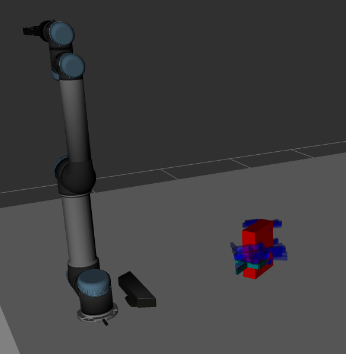
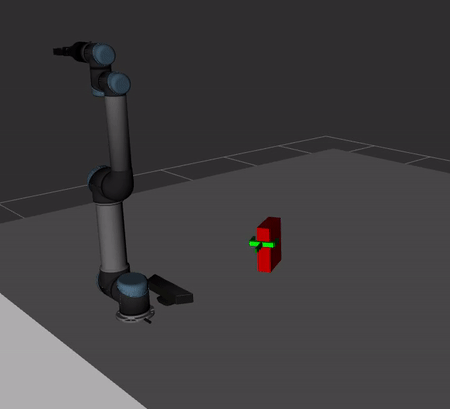
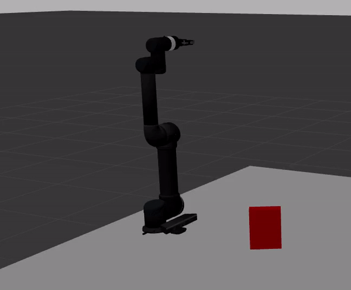

# Overview
Provides an interface for simulating grasp pose determination using a UR5 robot
with a Robotiq 85 gripper.

# Getting started
1) Download and install the [GPD library](https://github.com/atenpas/gpd). I am running Ubuntu 18.04 and ROS Melodic and found that in order to successfully use the GPD library the `-03` compiler optimization needs to be removed from the GPD `CMakeLists.txt`.

2) Download the rosinstall file

3) Check dependencies  
`rosdep update`  
`rosdep install --rosdistro $ROS_DISTRO --ignore-src --from-paths src`

4) Build  
`catkin_make`

# How to run

1) Launch the simulation  
`roslaunch ur_gazebo ur5_robotiq85.launch`  

`roslaunch ur5_robotiq85_moveit_config ur5_robotiq85_moveit_planning_execution.launch sim:=true`  

`roslaunch ur5_robotiq85_moveit_config moveit_rviz.launch config:=true`

2) Launch GPD  
`roslaunch gpd_simulation gpd_sim.launch`

3) To request a grasp candidate (this selected the current point cloud)  

`rosservice call /request_grasp`

4) Press `q` on the point cloud viewer window to continue the demo

# Results

On this run 26 grasp candidates (shown in blue) where generated.

  

The green marker is the highest ranked grasp candidate using point cloud data.

  

  

# Issues
1) In order to successfully use the GPD library the `-03` compiler optimization needs to be removed from the GPD `CMakeLists.txt`.

2) The gripper is not usually able to successfully lift the cracker box in Gazebo as a result of the difficulty in contact modeling. A possible future solution will use a world plugin to create the joint at run time.
